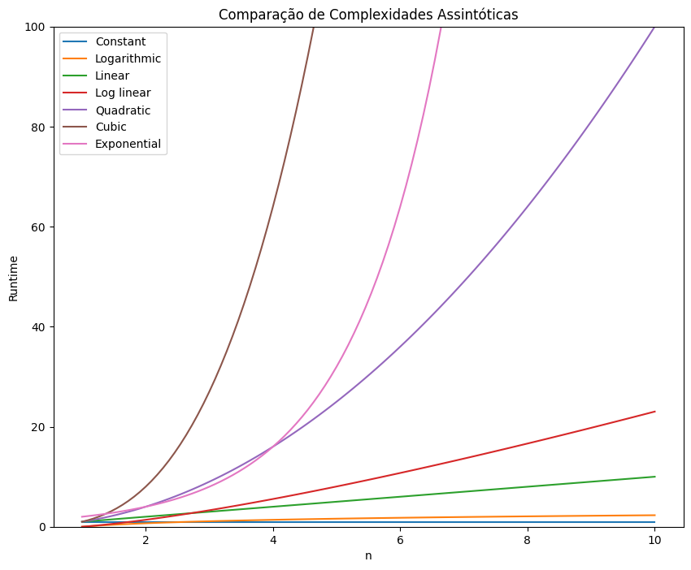

## Estrutura de Dados e Algoritmos em Python



## Git - configuração inicial

```bash
git init
git config user.name "Fernandes Macedo"
git config user.email masedos@egmail.com
git add -A .
git commit -m "first commit v1"
git push -u origin main
```